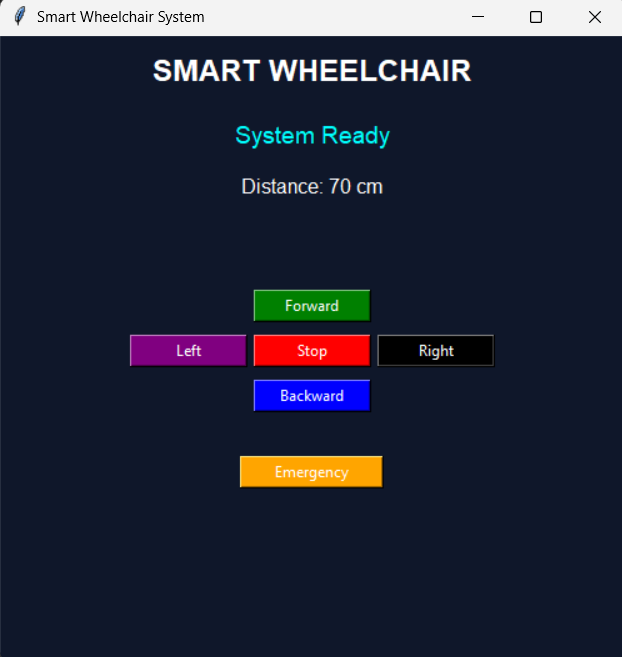

# 🚀 Smart Assistive Wheelchair System

## 📌 Overview
This project is a GUI-based simulation of a smart assistive wheelchair designed to assist physically and visually impaired individuals in safe navigation.

## ✨ Features
- 🧠 Obstacle detection (simulated using sensor logic)
- 🎮 Direction control (Forward, Backward, Left, Right)
- 🚨 Emergency alert system
- 🔊 Real-time voice feedback
- 🖥 Interactive graphical user interface

## 🛠 Technologies Used
- Python
- Tkinter (GUI)
- pyttsx3 (Text-to-Speech)

## 📸 Screenshot


## ▶ How to Run
```bash
python wheelchair_gui.py
